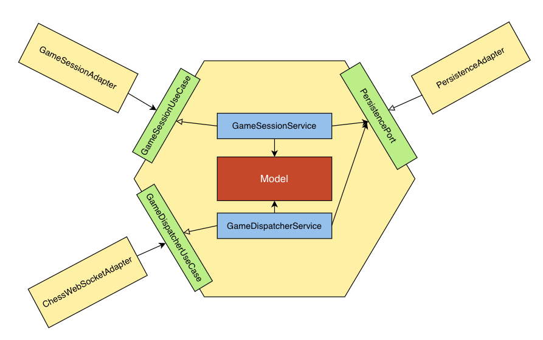

# Multi-player Chess Server App

### Feature:
- Game creation, player matchmaking, and real-time gameplay.
- Built with Spring Boot
- Following the principles of the hexagonal architecture.

### Demo:
// TODO

### How to run:
```` docker compose up````
### Architecture
This Chess Server App is designed using the hexagonal architecture (also known as the Ports and Adapters architecture). The main components include:



- **Application Core (domain package)**: This contains the domain logic, use cases, and business rules for managing chess games and players.

- **Adapters**: These are the entry points and exit points for the application, connecting it to the outside world. Adapters include REST controllers, database access, and WebSocket handlers.

- **Configuration**: Configuration files for Spring Boot, database connection, and other settings.

### Usage
You can interact with the Chess Server App via the RESTful API and WebSocket for real-time gameplay.

Or you can try running Front-end part here:
https://github.com/tuanduongnguyen209/chess-fe
